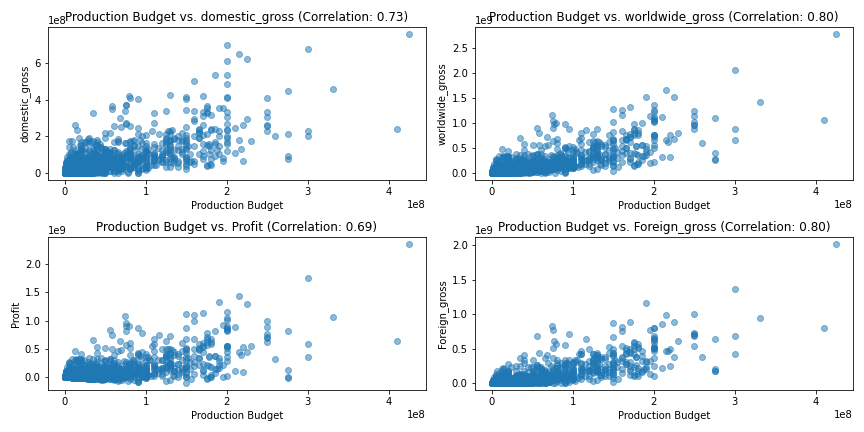
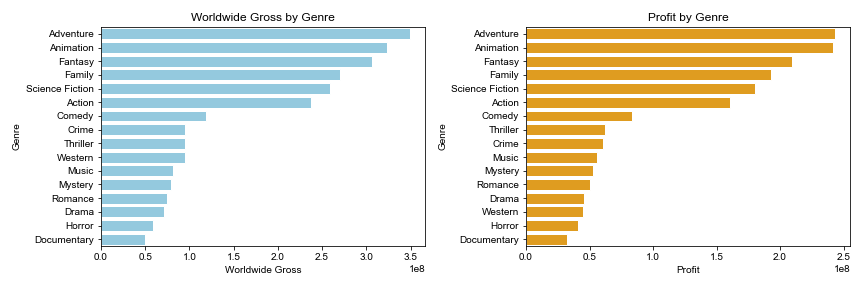
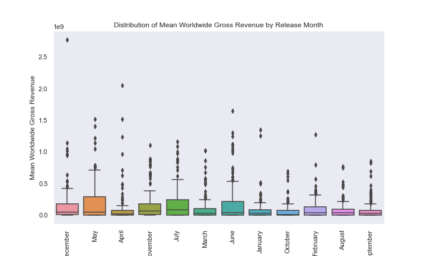

# Microsoft Movie Studio - Box Office Analysis

## Overview

Microsoft, a technology giant, is venturing into the entertainment industry with the establishment of a new movie studio. This strategic move aims to capitalize on the growing success of original video content creation. The primary objective of this project is to analyze box office trends to guide Microsoft's movie production decisions, ensuring a successful entry into the market.

## Business Background

Microsoft's new movie studio enters the highly competitive movie production industry with a focus on creating films that both creatively engage audiences and generate substantial box office revenue. Challenges include fierce competition, meeting diverse audience preferences, and leveraging Microsoft's technological expertise. Success hinges on producing high-quality, innovative content that resonates with viewers both creatively and financially.

## Data Science Objectives

1. **Analyze Budget vs. Revenue Relationship:** Investigate how production budgets influence box office success.
2. **Explore Genre-Based Revenue Performance:** Examine how different movie genres correlate with box office revenue.
3. **Analyze the Influence of Release Time on Revenue:** Explore how the timing of a movie's release impacts its box office earnings.
4. **Provide Actionable Insights for Movie Production:** Translate analysis findings into actionable recommendations for Microsoft's movie production decisions.

## Data Understanding

The project utilizes data from movie databases, encompassing attributes like production budgets, genres, release dates, and worldwide box office earnings. The primary target variable is "worldwide gross" (box office revenue), and key data properties include numerical budgets, categorical genres, date-based release dates, and continuous revenue values.

## Data Analysis

- **Univariate and Bivariate EDA:** Strong correlations were found between production budgets and revenue in this case the worldwide revenue and domestic revenue. Profit was also explored so as to see if it had a relationship with production budget and strong positive corelation was seen.

- **Top-Performing Genres:** Adventure, animation, fantasy, and family genres tend to generate the highest total revenue (worldwide gross) and profits. These genres consistently perform well at the box office, making them lucrative choices for movie production.

- **Prolific Genres:** The genres with the most movies produced are drama and comedy. This suggests that many movies include these genres as sub-genres or feature elements of drama and comedy within other genres.

- **Optimal Release Timing:** Months like December, May, April, and November were identified as optimal for movie releases. Months like May, July, and June exhibit taller boxes in the box plots, indicating higher revenue variability among movies released during these months. Box office performance during these months can be less predictable due to wider spreads of revenue values (interquartile range or IQR). Factors contributing to this variability include competition from other blockbuster releases, varying audience preferences, and major movie events or holidays.

## Recommendations

1. **Strategic Budget Allocation:** Allocate production budgets strategically to maximize returns.
2. **Genre Focus:** Prioritize genres with a history of strong box office performance.
3. **Release Timing Strategy:** Plan movie releases carefully, capitalizing on optimal months.
4. **Investigate Exceptional Performances:** Study and replicate successful strategies.
5. **Continuous Market Research:** Stay updated on audience preferences.
6. **Collaboration and Advanced Analytics:** Collaborate with industry experts and explore advanced analytics.

## Next Steps

- **Enhance Data Collection:** Collect additional data, including audience feedback and demographic information.
- **Ongoing Market Monitoring:** Continuously monitor industry trends and adapt strategies accordingly.

By following these recommendations and maintaining a data-driven, adaptable approach, Microsoft's new movie studio can position itself for success in the dynamic and competitive movie production industry.

## Authors

- Sammy Kariuki Kimani

Thank you for visiting our Film Analysis project repository!

